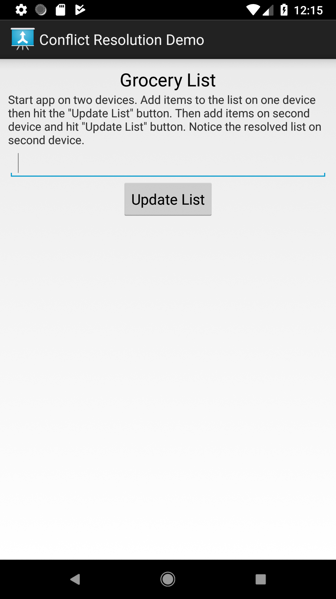
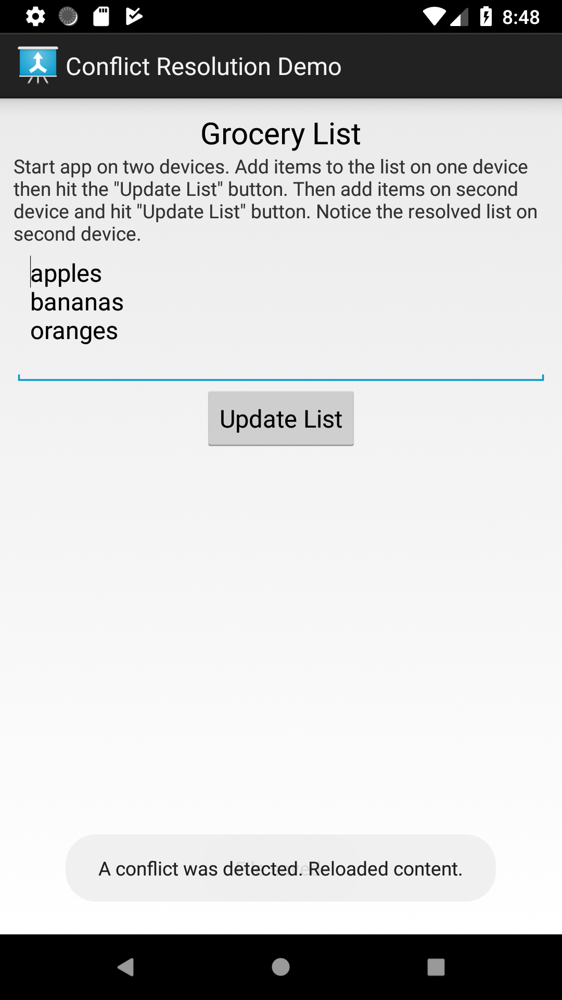

# [DEPRECATED] Google Drive Android API Conflict Sample

The Drive Android API used in this sample is now deprecated. Please see the
[migration guide](https://developers.google.com/drive/android/deprecation)
for more information.

---

This application demonstrates how to resolve remote [conflicts](https://developers.google.com/drive/android/completion#conflict) using
the [Google Android Drive API](https://developers.google.com/drive/android/intro). Keep in mind the default behavior is to
overwrite the server content with the local content when a conflict arises. Please read the
[conflict strategy documentation](https://developers.google.com/android/reference/com/google/android/gms/drive/ExecutionOptions.Builder#setConflictStrategy(int)) when
choosing to override this capability. This application uses the [CONFLICT_STRATEGY_KEEP_REMOTE](https://developers.google.com/android/reference/com/google/android/gms/drive/ExecutionOptions#CONFLICT_STRATEGY_KEEP_REMOTE)
option to allow the remote app (not the server) to manage the conflict.

## Set Up
1. Install the [Android SDK](https://developer.android.com/sdk/index.html).
1. Download and configure the
[Google Play services SDK](https://developer.android.com/google/play-services/setup.html),
which includes the Google Drive Android API.
1. Create [Google API Console](https://console.developers.google.com/projectselector/apis/dashboard)
project and/or enable the Drive API for an existing project.
1. Register an OAuth 2.0 client for the package 'com.google.android.gms.drive.sample.conflict'
with your own [debug keys](https://developers.google.com/drive/android/auth).
See full instructions in the [Getting Started guide](https://developers.google.com/drive/android/get-started).
1. Build and install the app on 2 devices or emulators. If using Android Studio, install the app
individually on each emulator then use the AVD Manager to run both emulators simultaneously. Be
sure to select Android images that have the Play Store enabled.

## Run the Demo
Launch the application on both devices. Both apps should like this with no items listed.

Add an item to the first device's list and hit 'Update List'.

The second device should then show the item. Now add items on the second device's list.
After updating the list, both devices should show the merge lists.

